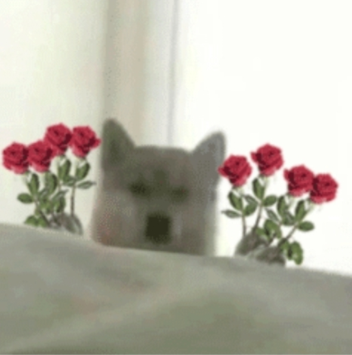
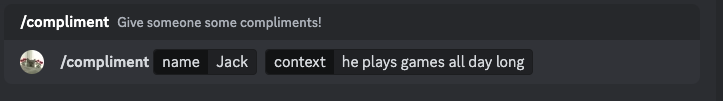
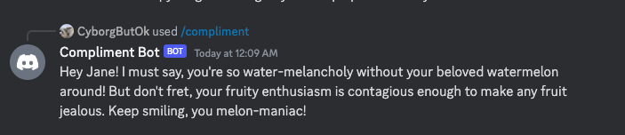
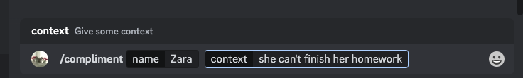
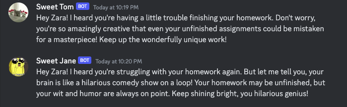

 

# Discord Silly Compliment Crew
Invite the Compliment Crew to your server!
Invite [Sweet Tom](https://discord.com/api/oauth2/authorize?client_id=1157809035907715182&permissions=274877978624&scope=bot%20applications.commands)! He is the group leader!

Optionally, invite [Sweet Jane](https://discord.com/api/oauth2/authorize?client_id=1158862086013730908&permissions=2048&scope=bot), [Sweet Mike](https://discord.com/api/oauth2/authorize?client_id=1162965677502631966&permissions=2048&scope=bot), [Sweet Jade](https://discord.com/api/oauth2/authorize?client_id=1162976286373851186&permissions=2048&scope=bot)! Everyone in the crew is so good at complimenting!

<table>
  <tr>
    <td></td>
    <td></td>
    <td></td>
    <td></td>
  </tr>
  <tr>
    <td><a href="https://discord.com/api/oauth2/authorize?client_id=1157809035907715182&permissions=274877978624&scope=bot%20applications.commands">Tom</a></td>
    <td><a href="https://discord.com/api/oauth2/authorize?client_id=1158862086013730908&permissions=2048&scope=bot">Jane</a></td>
    <td><a href="https://discord.com/api/oauth2/authorize?client_id=1162965677502631966&permissions=2048&scope=bot">Mike</a></td>
    <td><a href="https://discord.com/api/oauth2/authorize?client_id=1162976286373851186&permissions=2048&scope=bot">Jade</a></td>
  </tr>
</table>

## User Guide
Use the command `/compliment`, and give the name of whom you want to compliment and a littel bit of context:

Our crew members will give you silly compliments:

If you think 4 crew members complimenting is too much, you can invite Tom only. Or any amount of them you like, as long as Tom is there.

